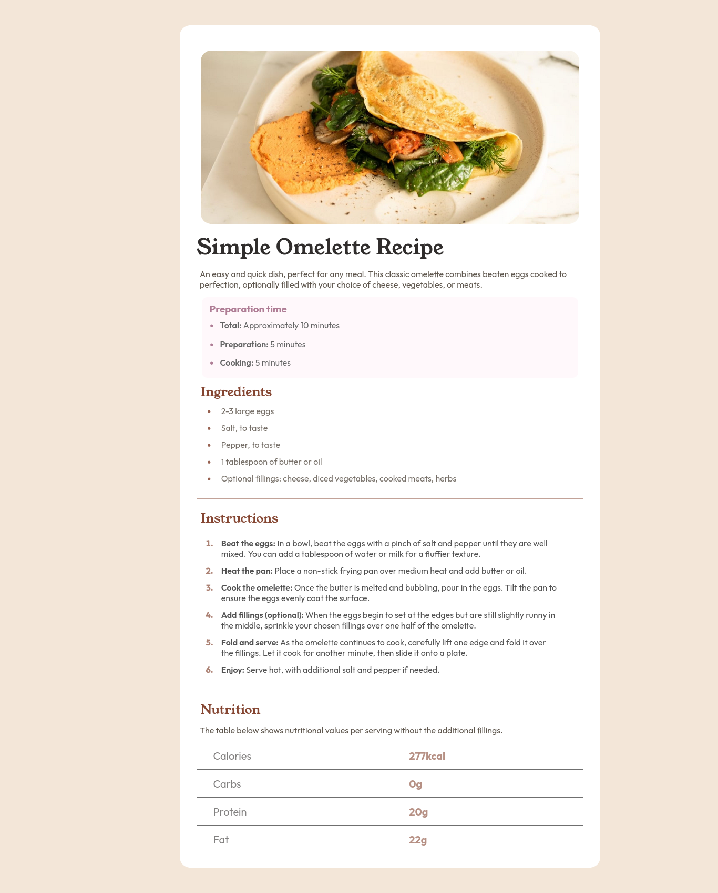

# Frontend Mentor - Recipe page solution

This is a solution to the [Recipe page challenge on Frontend Mentor](https://www.frontendmentor.io/challenges/recipe-page-KiTsR8QQKm). Frontend Mentor challenges help you improve your coding skills by building realistic projects. 

## Table of contents

- [Overview](#overview)
  - [The challenge](#the-challenge)
  - [Screenshot](#screenshot)
  - [Links](#links)
- [My process](#my-process)
  - [Built with](#built-with)
  - [What I learned](#what-i-learned)
  - [Continued development](#continued-development)
  - [Useful resources](#useful-resources)


## Overview

### Screenshot




### Links

- Solution URL (View Code): [Solution URL here](https://github.com/Karan551/recipie_project)
- Live Site URL (View Site): [Live site URL here](https://karan551.github.io/recipie_project/)

## My process

### Built with

- Semantic HTML5 markup
- CSS custom properties
- Flexbox
- Grid
### What I learned

Use this section to recap over some of your major learnings while working through this project. Writing these out and providing code samples of areas you want to highlight is a great way to reinforce your own knowledge.

To see how you can add code snippets, see below:

```html
 <h1 class="main-heading">Simple Omelette Recipe</h1>
```

```css
.container {
    width: 80%;
    max-width: 1200px;
    margin: 2.5rem auto;
    background-color: hsl(0, 0%, 100%);
    border-radius: 20px;
    padding: 1.5rem 2rem;
    padding-top: 2rem;
}

```

### Continued development

Use this section to outline areas that you want to continue focusing on in future projects. These could be concepts you're still not completely comfortable with or techniques you found useful that you want to refine and perfect.

**Note: Delete this note and the content within this section and replace with your own plans for continued development.**

### Useful resources

- [CSS resource 1](https://developer.mozilla.org/en-US/docs/Learn/Getting_started_with_the_web/CSS_basics) - I really liked this pattern and will use it going forward.
- [Grid resource 2](https://css-tricks.com/snippets/css/complete-guide-grid/) - This is an amazing article which helped me finally understand Grid Layout. I'd recommend it to anyone still learning this concept.

